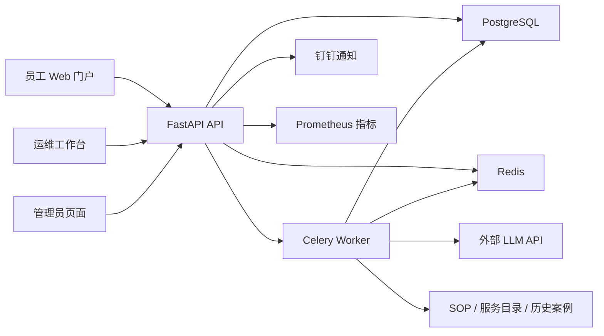

# IntelliTicket 产品与架构改造执行方案

> 状态：P0-P5 计划任务已完成，项目已收尾；真实外部 API 冒烟未执行
> 目标版本：v0.2.0  
> 项目定位：单公司、单实例的 AI 增强型 IT 服务台  
> 目标用户：企业员工、IT 运维人员、系统管理员  
> 部署假设：使用外部 LLM API，不部署本地大模型  
> 容量表述：完成真实部署和压测前，不承诺具体团队人数或并发量

## 1. 改造目标

当前项目已经具备工单提交、历史记录、AI 分类与诊断、证据引用、SOP/案例检索、WebSocket 进度、基础状态和测试等能力，但产品主线仍然是“输入故障描述，观看多个 Agent 生成报告”。

本次改造要把系统调整为真正可讲清楚的 IT 服务台闭环：

```text
员工提交工单
  -> 系统持久化并计算初始 SLA
  -> AI 异步完成分类、定级、服务匹配和诊断建议
  -> 工单进入运维队列
  -> 运维认领或管理员分派
  -> 运维与员工沟通、记录处理过程
  -> 运维填写根因、修复动作和验证结果并标记已解决
  -> 员工确认关闭或重新打开
  -> 已确认结果进入历史案例检索
```

改造完成后，项目在简历中的核心表达应是：

> 设计并实现 AI 增强型 IT 服务台，将智能分诊、SLA 跟踪、人工认领、处理协作、解决验收和历史案例沉淀串成完整闭环；AI 只提供带证据的建议，关键状态变更由人工确认并写入审计时间线。

## 2. 产品边界

### 2.1 本期要做

- 单公司、单实例部署，不做 SaaS 多租户。
- 员工、运维、管理员三种角色。
- 工单创建、查看、认领、分派、评论、解决、确认关闭、重新打开和取消。
- 面向工单的公开回复、内部备注和完整事件时间线。
- SLA 截止时间与超时标记。
- AI 异步分诊、上下文检索、诊断建议和建议回复。
- AI 失败时不影响工单创建和人工处理。
- PostgreSQL 生产存储，SQLite 可保留为单元测试数据库。
- Redis + Celery 持久化 AI 任务。
- Docker Compose 部署、健康检查、基础监控和真实压测脚本。

### 2.2 本期不做

- 不做多租户、计费、套餐和租户级数据隔离。
- 不做完整 Jira、ServiceNow 或 ITIL 平台复刻。
- 不做 CMDB、资产采购、复杂审批流和排班系统。
- 不引入 Kafka、Kubernetes、Elasticsearch 或微服务拆分。
- 不允许 AI 自动执行生产命令、修改服务器或直接关闭工单。
- 不为了“多 Agent”数量保留没有独立职责的 Agent。
- 不展示尚未实现的事件管理、问题管理、变更管理等空模块。

这些边界用于控制改造成本。项目的竞争力来自闭环完整、AI 可解释和工程可靠，不来自堆叠平台名词。

## 3. 当前设计问题

| 问题 | 当前表现 | 改造方向 |
|---|---|---|
| 产品重心偏移 | 7 个 Agent 和执行链路比工单协作更突出 | 工单流程作为主线，AI 收进可折叠的建议面板 |
| 状态概念混淆 | `ticket_status` 与 AI `run status` 同时影响展示 | 严格拆分业务状态与 AI 任务状态 |
| 协作闭环不完整 | 有 `claimed_by`、SLA 等字段，但缺少完整认领/转派接口 | 建立状态机、认领事务、分派接口和事件日志 |
| 权限边界不完整 | 部分列表和详情接口不要求登录 | 所有工单接口执行身份、角色和数据范围检查 |
| 演示账号硬编码 | 用户存储为内存字典，前端显示固定账号密码 | 数据库用户、环境变量初始化管理员、无演示密码 |
| 任务不持久 | WebSocket 请求内启动本地线程 | Celery 执行 AI 任务，WebSocket/SSE 只负责进度展示 |
| 存储难扩展 | 单个大型 SQLite Repository 手写表结构和迁移 | SQLAlchemy 2.0 + Alembic，PostgreSQL 用于生产 |
| 前端职责集中 | `App.tsx` 承担路由、页面、业务动作和状态拼装 | 按角色和页面拆分，增加正式前端路由 |
| Mock 与真实模式割裂 | 员工提交固定发送 `data_mode='mock'` | 模式由后端部署配置决定，客户端不能伪造模式 |
| 桌面端收益不足 | Electron 未使用明显桌面原生能力 | Web 作为主交付形态，Electron 仅保留为可选壳层 |

## 4. 目标架构



### 4.1 架构原则

1. 工单必须先写数据库，再投递 AI 任务。
2. AI 结果是建议，不直接覆盖人工结论。
3. AI 失败只改变 AI 任务状态，不把工单标记为失败。
4. 每次业务状态变化与审计事件在同一数据库事务中提交。
5. 权限检查集中在服务层或依赖项中，不能只依赖前端隐藏按钮。
6. 认领和转派必须使用条件更新或行锁，防止两名运维同时认领。
7. API 进程保持无状态，允许后续启动多个实例。
8. 外部模型提供商通过统一客户端抽象切换，不把供应商字段散落到业务代码。

## 5. 领域模型

### 5.1 角色与权限

| 能力 | employee | operator | admin |
|---|---:|---:|---:|
| 创建工单 | 是 | 是 | 是 |
| 查看自己的工单 | 是 | 是 | 是 |
| 查看运维队列 | 否 | 是 | 是 |
| 查看全部工单 | 否 | 按运维数据范围 | 是 |
| 公开回复 | 自己的工单 | 是 | 是 |
| 内部备注 | 否 | 是 | 是 |
| 认领工单 | 否 | 是 | 是 |
| 转派工单 | 否 | 否 | 是 |
| 标记已解决 | 否 | 当前处理人 | 是 |
| 确认关闭/重新打开 | 自己的工单 | 否 | 是 |
| 管理用户、团队和 SLA | 否 | 否 | 是 |

MVP 中运维可查看同一实例的待处理队列；若后续增加部门隔离，再引入 `department_id`，本期不要预埋多租户模型。

### 5.2 工单状态机

业务状态固定为：

```text
pending     已提交，等待 AI 分诊或人工受理
open        已受理，等待认领/分派
in_progress 已被认领，正在处理
resolved    运维已给出处理结果，等待提交人确认
closed      提交人确认完成或管理员关闭
cancelled   提交人或管理员取消
```

允许的转换：

| 当前状态 | 动作 | 下一状态 | 约束 |
|---|---|---|---|
| 无 | submit | pending | 必须有标题和描述 |
| pending | triage_complete | open | AI 失败也允许人工执行该转换 |
| pending/open | claim | in_progress | 仅 operator/admin，必须原子认领 |
| pending/open/in_progress | assign | in_progress | 仅 admin |
| in_progress | resolve | resolved | 必填根因、修复动作、验证方式和解决摘要 |
| resolved | confirm | closed | 提交人或 admin |
| resolved/closed | reopen | open | 必填重新打开原因 |
| pending/open | cancel | cancelled | 提交人仅能取消自己的工单，admin 可取消 |

禁止通过通用 `PATCH` 任意写入状态。每个业务动作使用独立命令接口，由状态机校验转换是否合法。

AI 运行状态独立保存为：

```text
queued -> running -> completed
                  -> failed
                  -> cancelled
```

### 5.3 数据表

使用 SQLAlchemy 2.0 声明模型和 Alembic 管理迁移。FastAPI 当前以同步路由为主，本期优先使用同步 SQLAlchemy Session + psycopg，避免为小团队场景无收益地全面改 async。

#### users

- `id` UUID/字符串主键
- `username` 唯一
- `display_name`
- `role`: employee/operator/admin
- `password_hash`
- `team_id` 可空
- `is_active`
- `created_at`、`updated_at`

#### teams

- `id`
- `code` 唯一
- `name`
- `is_active`
- `created_at`、`updated_at`

#### tickets

- `id`
- `title`
- `description`
- `desk_id`
- `category`
- `status`
- `priority`
- `submitter_id`
- `assigned_team_id` 可空
- `assignee_id` 可空
- `affected_service` 可空
- `resolution_summary` 可空
- `root_cause` 可空
- `fix_action` 可空
- `verification` 可空
- `response_due_at` 可空
- `resolution_due_at` 可空
- `first_responded_at` 可空
- `resolved_at` 可空
- `closed_at` 可空
- `version` 乐观锁版本号
- `created_at`、`updated_at`

#### ticket_comments

- `id`
- `ticket_id`
- `author_id`
- `visibility`: public/internal
- `body`
- `created_at`、`updated_at`

员工只能看到 `public` 评论；运维和管理员可以看到两种评论。

#### ticket_events

只追加、不修改，用于审计时间线：

- `id`
- `ticket_id`
- `actor_id`，系统事件可空
- `event_type`
- `from_status` 可空
- `to_status` 可空
- `visibility`: public/internal
- `payload_json`
- `created_at`

至少记录：创建、AI 分诊开始/完成/失败、认领、转派、评论、内部备注、解决、确认关闭、重新打开、取消和 AI 重跑。

#### attachments

- `id`
- `ticket_id`
- `uploader_id`
- `original_name`
- `storage_key`
- `content_type`
- `size_bytes`
- `sha256`
- `created_at`

开发环境使用本地目录，生产环境通过 `AttachmentStorage` 接口切换 MinIO/S3。限制扩展名、MIME、体积并使用服务端生成的存储名。

#### ai_runs

- `id`
- `ticket_id`
- `status`
- `pipeline_version`
- `provider`
- `model`
- `prompt_version`
- `input_hash`
- `result_json` 可空
- `error_code`、`error_message` 可空
- `prompt_tokens`、`completion_tokens` 可空
- `retry_count`
- `started_at`、`completed_at`、`created_at`

#### service_catalog / sla_policies

服务目录保存服务名、所属团队、关键词和默认分类。SLA 策略按优先级配置首次响应和解决时限。本期按自然时间计算，不实现复杂工作日历；README 必须明确这一限制。

### 5.4 旧数据处理

- 不直接删除当前 SQLite 文件。
- 新增一次性迁移脚本 `scripts/migrate_legacy_sqlite.py`，读取旧表并写入新模型。
- 旧字段 `latest_run` 转为 `ai_runs`；无法可靠映射的字段写入迁移报告，不伪造数据。
- 自动化测试默认创建临时 SQLite 数据库，生产配置强制 PostgreSQL。

## 6. API 设计

统一前缀：`/api/v1`。错误响应保持结构化，至少包含 `code`、`message`、`details`。

### 6.1 认证与管理

| 方法 | 路径 | 权限 | 说明 |
|---|---|---|---|
| POST | `/auth/login` | 公开 | 登录 |
| GET | `/users/me` | 登录 | 当前用户，服务端回查账号状态 |
| GET/POST/PATCH | `/users` | admin | 用户管理 |
| GET/POST/PATCH | `/teams` | admin | 团队管理 |
| GET/POST/PATCH | `/sla-policies` | admin | SLA 配置 |

安全要求：

- Token 签名密钥来自 `JWT_SECRET_KEY`，生产环境拒绝默认值。
- Token 验证后回查数据库，已停用用户立即失效。
- 不提供硬编码演示账号。
- 首次管理员通过 `BOOTSTRAP_ADMIN_USERNAME` 和 `BOOTSTRAP_ADMIN_PASSWORD` 创建。
- 所有密码只存强哈希；日志、响应和异常中不得输出密码或外部 API Key。

### 6.2 工单查询与创建

| 方法 | 路径 | 权限 | 说明 |
|---|---|---|---|
| POST | `/tickets` | 登录 | 创建工单，返回后立即可查询 |
| GET | `/tickets/mine` | 登录 | 当前用户提交的工单 |
| GET | `/tickets/queue` | operator/admin | 队列筛选 |
| GET | `/tickets/{id}` | 按数据范围 | 工单详情 |
| GET | `/tickets/{id}/events` | 按数据范围 | 可见事件时间线 |
| GET | `/tickets/{id}/ai-runs` | operator/admin | AI 运行记录 |

队列筛选至少支持：状态、优先级、服务、团队、处理人、SLA 是否超时、关键词、创建时间和分页。排序在数据库完成，不能只对前端已加载的 100 条记录排序。

### 6.3 命令接口

| 方法 | 路径 | 权限 | 说明 |
|---|---|---|---|
| POST | `/tickets/{id}/accept` | operator/admin | 人工受理，AI 失败时可用 |
| POST | `/tickets/{id}/claim` | operator/admin | 原子认领 |
| PATCH | `/tickets/{id}/assignment` | admin | 转派团队/处理人 |
| POST | `/tickets/{id}/comments` | 登录 | 公开回复或内部备注 |
| POST | `/tickets/{id}/resolve` | assignee/admin | 填写处理结论并标记已解决 |
| POST | `/tickets/{id}/confirm` | submitter/admin | 确认关闭 |
| POST | `/tickets/{id}/reopen` | submitter/admin | 重新打开 |
| POST | `/tickets/{id}/cancel` | submitter/admin | 取消 |
| POST | `/tickets/{id}/ai-runs` | operator/admin | 手动重新分析 |

并发与幂等要求：

- 认领使用 `UPDATE ... WHERE assignee_id IS NULL AND status IN (...)` 或数据库行锁；失败返回 `409 TICKET_ALREADY_CLAIMED`。
- 命令请求携带 `version`，版本冲突返回 `409 TICKET_VERSION_CONFLICT`。
- 创建接口支持 `Idempotency-Key`，重复提交返回同一工单。
- 状态更新和 `ticket_events` 插入必须同事务提交。

### 6.4 进度推送

保留 WebSocket 或改用 SSE 均可，但推送层只读取 Celery/Redis 中的任务进度，不再在 API 进程内启动线程执行 AI。

至少推送：

- `queued`
- `stage_started`
- `stage_completed`
- `completed`
- `failed`

客户端断线不取消后台 AI 任务。用户重新进入工单详情后，可以通过 `ai_runs` 查询当前状态和结果。

## 7. AI 流程重构

### 7.1 从 7 Agent 收缩为三阶段

#### 阶段 A：Triage

输入：标题、描述、服务目录和少量规则。  
输出：分类、优先级、受影响服务、推荐团队、缺失信息、置信度和理由。

优先级先由确定性规则给出底线，例如安全事件、生产不可用、多人受影响不能被模型降级。LLM 可以提高优先级或补充理由，但不能绕过规则下限。

#### 阶段 B：Retrieve + Diagnose

工具检索服务目录、指标快照、部署记录、历史事件、SOP 和已确认历史案例。一次诊断模型调用输出：

- 最多 3 个根因候选；
- 每个候选的置信度与 `evidence_ids`；
- 建议排查步骤；
- 建议回复草稿；
- 当前未知信息和需要人工确认的事项。

#### 阶段 C：Quality Gate

默认使用确定性校验，不必再调用一个 Reviewer LLM：

- JSON Schema 校验；
- 证据 ID 必须真实存在；
- 推荐团队必须来自服务目录；
- 高风险动作必须标记为人工执行；
- 事实、推断、未知和建议分开；
- 缺少证据时降低置信度或 abstain。

只有在 P1/P2 高优先级工单且配置开启时，才允许额外模型复核。这样更容易解释成本、延迟和收益。

### 7.2 AI 输出使用方式

- AI 分类和优先级保存为“建议值”，运维接受后才成为人工确认值。
- 界面必须显示建议来源、置信度、理由、证据和运行时间。
- 运维接受、修改或拒绝 AI 建议时写入事件，供后续评估准确率。
- 已关闭工单只有在根因和解决方法经过人工确认后，才能进入案例检索。
- 不把 Mock 数据包装成真实监控结论；所有证据继续保留 `mock/real` 标记。

### 7.3 外部模型与失败策略

- 复用并收敛现有 LLM 客户端抽象，支持通过配置切换外部模型。
- 设置连接、读取和总超时；仅对网络错误、限流和 5xx 做有限重试。
- 使用 Celery 指数退避，最大重试次数可配置。
- API Key 缺失或模型不可用时，工单仍可人工受理和处理。
- 记录模型、Prompt 版本、Token 用量和耗时，但不记录密钥或完整敏感 Prompt。

## 8. 前端重构

### 8.1 交付形态

React Web 为主交付形态。尽量复用当前 renderer 代码；Electron 主进程和 preload 先保留为可选壳层，等 Web 构建稳定后再决定是否删除。不要在本轮同时重写技术栈。

增加 `react-router-dom`，按页面拆分当前大型 `App.tsx`：

```text
frontend/src/renderer/src/
  app/
    router.tsx
    AuthProvider.tsx
  layouts/
    EmployeeLayout.tsx
    OperatorLayout.tsx
    AdminLayout.tsx
  pages/
    employee/NewTicketPage.tsx
    employee/MyTicketsPage.tsx
    operator/QueuePage.tsx
    operator/MyWorkPage.tsx
    shared/TicketDetailPage.tsx
    admin/UsersPage.tsx
    admin/TeamsPage.tsx
    admin/SlaPoliciesPage.tsx
  features/
    tickets/
    comments/
    ai-analysis/
    attachments/
```

### 8.2 员工端

- 新建工单：标题、描述、分类、附件。
- 我的工单：按状态筛选，不显示其他用户数据。
- 工单详情：公开时间线、运维回复、附件、解决结果。
- `resolved` 状态显示“确认解决”和“仍有问题”两个明确动作。
- 不向员工展示原始 Agent 执行步骤、内部备注、内部证据或模型调试信息。

### 8.3 运维端

- 待处理队列：状态、优先级、SLA、服务、提交人、处理人和更新时间。
- 我的工作：当前用户已认领工单。
- 工单详情：基础信息、对话时间线、处理动作、AI 建议、证据和历史案例。
- AI 建议放在可折叠区域，显示“接受/修改/拒绝”，不能覆盖人工输入。
- 解决工单时使用结构化表单：根因、修复动作、验证方式、解决摘要。

### 8.4 管理员端

只实现真正可用的最小配置：

- 用户启停和角色；
- 团队配置；
- SLA 策略；
- 服务目录与所属团队。

未实现的报表、事件、问题、变更等导航项直接移除，不保留空页面。

### 8.5 交互要求

- 工单列表和详情使用独立路由，刷新页面后仍能回到当前工单。
- 不再把列表、详情和完整 AI 调试链同时压在一个横向滚动页面中。
- 业务状态使用一个主状态标签；AI 任务状态放在“AI 分析”区域。
- 桌面端 1440x900 和移动端 390x844 都不能出现文字重叠或横向主页面溢出。
- 空状态、加载、权限不足、AI 失败、任务重试和版本冲突都要有明确界面状态。

## 9. 分阶段实施计划

每个阶段完成后先运行对应测试，再进入下一阶段。不要一次性删除旧实现。

### P0：安全与数据基础

目标：让用户、权限和工单存储成为可信基础。

任务：

- [x] 增加 SQLAlchemy、Alembic、psycopg 和数据库会话管理。
- [x] 创建 users、teams、tickets、ticket_events、ticket_comments、ai_runs、sla_policies 表。
- [x] 将用户从内存字典迁移到数据库。
- [x] JWT/HMAC 签名密钥改为环境变量，认证后回查有效用户。
- [x] 创建 bootstrap admin 逻辑，移除前端演示账号密码。
- [x] 为所有工单列表、详情、知识统计和 WebSocket 增加权限校验。
- [x] 后端决定 `data_mode`，客户端不得强制提交 `mock`。
- [x] 保留旧 SQLite 文件，提供 Alembic 初始迁移。

验收：

- 未登录访问任何工单数据返回 401。
- 员工不能查看其他员工工单。
- operator 不能调用管理员接口。
- 停用用户的旧 Token 立即失效。
- 生产配置存在默认密钥或默认管理员密码时拒绝启动。
- 后端测试通过，旧测试按新认证方式调整但不得简单删除。

建议主要修改/新增：

```text
pyproject.toml
src/intelliticket_backend/config.py
src/intelliticket_backend/db.py
src/intelliticket_backend/models/*
src/intelliticket_backend/api/auth.py
src/intelliticket_backend/services/auth.py
src/intelliticket_backend/services/permissions.py
src/intelliticket_backend/repositories/*
migrations/*
tests/test_auth_*.py
tests/test_permissions.py
```

### P1：工单协作闭环

目标：不依赖 AI，也能完整处理一张工单。

任务：

- [x] 实现显式状态机服务 `TicketWorkflowService`。
- [x] 增加人工受理、原子认领、管理员转派接口。
- [x] 增加公开评论、内部备注和时间线查询。
- [x] 增加解决、提交人确认关闭、重新打开和取消接口。
- [x] 状态变化与事件日志同事务写入。
- [x] 增加乐观锁版本与 409 冲突错误。
- [x] 增加首次响应和解决 SLA 计算及超时查询。
- [x] 保留并适配根因、修复动作和验证字段。

验收：

- 两个运维同时认领时只有一个成功，另一个收到 409。
- 未填写根因、修复动作和验证方式不能标记已解决。
- 运维不能代替员工普通确认关闭，admin 例外。
- 员工看不到内部备注。
- 每个动作都能在时间线中找到操作者、时间和状态变化。
- AI 完全不可用时，完整人工流程仍可走通。

建议主要修改/新增：

```text
src/intelliticket_backend/schemas/tickets.py
src/intelliticket_backend/schemas/ticket_history.py
src/intelliticket_backend/api/tickets.py
src/intelliticket_backend/services/ticket_workflow.py
src/intelliticket_backend/repositories/tickets.py
tests/test_ticket_state_machine.py
tests/test_ticket_claim_concurrency.py
tests/test_ticket_comments.py
tests/test_ticket_end_to_end.py
```

### P2：AI 异步化与流程收敛

目标：AI 成为可恢复、可解释的辅助能力。

任务：

- [x] 增加 Redis、Celery Worker 和 AI 任务持久化。
- [x] 创建工单后提交 triage 任务，先落库后入队。
- [x] 将 7 Agent 收敛为 Triage、Retrieve+Diagnose、Quality Gate 三阶段。
- [x] 保留现有 Context、Diagnosis、Evidence、SOP 和案例检索中可复用逻辑。
- [x] 删除或停止调用仅为展示而存在的 Agent 串联。
- [x] 保存模型、Prompt 版本、证据、置信度、耗时、Token 和错误。
- [x] 实现有限重试、陈旧任务恢复和手动重跑。
- [x] WebSocket/SSE 改为订阅任务状态，不在 API 内启动 Thread。
- [x] 记录运维对 AI 建议的接受、修改和拒绝。

验收：

- API 或浏览器断开后 AI 任务继续执行。
- Worker 重启后 queued/running 陈旧任务可恢复或明确失败。
- AI 失败不改变工单业务状态为 failed。
- 所有诊断结论引用的证据 ID 均真实存在。
- 同一输入可追踪使用的模型、Prompt 版本和流水线版本。
- 与现有 7 Agent 基线相比，记录单次处理的外部调用次数和耗时变化。

建议主要修改/新增：

```text
src/intelliticket_backend/services/ai_pipeline.py
src/intelliticket_backend/services/worker_tasks.py
src/intelliticket_backend/services/llm.py
src/intelliticket_backend/services/agents/*
src/intelliticket_backend/api/tickets.py
src/intelliticket_backend/worker.py
tests/test_ai_pipeline.py
tests/test_ai_task_recovery.py
tests/test_llm_failure_fallback.py
```

### P3：前端角色化重构

目标：让界面围绕用户任务，而不是围绕技术模块。

任务：

- [x] 增加前端路由和角色布局。
- [x] 将 `App.tsx` 拆分为员工、运维、管理员页面。
- [x] 员工端实现新建、我的工单、详情、评论、确认和重新打开。
- [x] 运维端实现队列、我的工作、认领、处理时间线和解决表单。
- [x] 管理端实现用户、团队、SLA 和服务目录最小配置。
- [x] AI 建议和证据改为工单详情中的辅助面板。
- [x] 移除空导航、演示账号提示、固定 Mock 模式和伪报表。
- [x] Web 生产构建作为主产物，Electron 保持可选。

验收：

- 三种角色登录后只看到自己能执行的工作流。
- 刷新工单详情 URL 后仍能恢复当前页面。
- 员工无法通过前端或直接 API 看到内部备注。
- AI 失败时运维页面仍能评论、认领和解决。
- 前端类型检查、单元测试和生产构建通过。
- 使用 Playwright 检查 1440x900、1280x720 和 390x844，无主要重叠和横向溢出。

建议主要修改/新增：

```text
frontend/package.json
frontend/src/renderer/src/App.tsx
frontend/src/renderer/src/app/*
frontend/src/renderer/src/layouts/*
frontend/src/renderer/src/pages/*
frontend/src/renderer/src/features/*
frontend/src/renderer/src/api/*
frontend/src/renderer/src/styles.css
```

### P4：附件、通知与部署可靠性

目标：具备小型内部试点的工程基础，但不做未经验证的容量承诺。

任务：

- [x] 实现附件上传、下载、权限和安全校验。
- [x] 钉钉通知改为异步、可重试并记录发送结果。
- [x] 增加 PostgreSQL、Redis、API、Worker、Frontend/Nginx 的 Docker Compose。
- [x] 增加数据库和附件备份/恢复脚本。
- [x] 增加 `/health`、`/ready` 和 Prometheus 指标。
- [x] 增加 API 请求量、延迟、AI 任务量、失败率、队列长度和 SLA 超时指标。
- [x] 增加 Nginx 限流、上传大小限制和安全响应头。

验收：

- Compose 能从空数据库完成迁移并启动全部服务。
- API 只有在数据库和 Redis 就绪后返回 ready。
- Worker/LLM 故障时 API 仍能创建和查询工单。
- 非授权用户不能下载附件。
- 备份文件可在全新实例恢复。

### P5：真实验证、文档与简历材料

目标：只写能够被测试和证据支撑的项目描述。

任务：

- [x] 编写完整集成测试：员工提交 -> AI 分诊 -> 运维认领 -> 回复 -> 解决 -> 员工关闭。
- [x] 编写故障测试：LLM 超时、Redis 中断、Worker 重启、重复认领、权限越权。
- [x] 使用 k6 或 Locust 压测创建、队列查询、详情查询和并发认领。
- [x] 记录测试机器配置、数据量、并发数、P50/P95/P99、错误率和瓶颈。
- [x] 更新 README、部署文档、架构图、API 示例和面试问答。
- [x] 删除“企业级”“支持 N 人”等未经验证的表述。

验收：

- `pytest`、前端测试、类型检查和生产构建全部通过。
- 真实外部 API 冒烟测试通过，但测试日志不泄漏密钥。
- Docker Compose 冒烟测试通过。
- README 中每个核心能力都能对应到接口、测试或可复现操作。
- 简历描述能清楚回答：为什么异步、为什么人工确认、怎么防重复认领、AI 失败怎么办、权限如何隔离、SLA 怎么计算。

收尾记录：按项目所有者决定，不再执行文档完成后的最终全量回归；最后一次完整后端/前端基线与 P5 定向测试结果记录在 `docs/test-report.md`。当前环境没有已轮换的 `DEEPSEEK_API_KEY`，真实外部 API 冒烟未执行，不能视为该条验收通过。

## 10. 测试矩阵

| 层级 | 必测内容 |
|---|---|
| 单元测试 | 状态机、权限矩阵、SLA、密码、AI Schema、证据校验 |
| Repository | 事务、分页、筛选、乐观锁、原子认领、事件写入 |
| API 集成 | 登录、越权、完整工单流程、附件、评论可见性 |
| Worker | 入队、重试、恢复、幂等、LLM 降级 |
| 前端 | 三角色路由、按钮权限、表单校验、冲突和失败状态 |
| E2E | 员工到运维再回到员工的完整闭环 |
| 压测 | 创建、队列、详情、认领冲突和 AI 队列堆积 |

关键测试场景：

1. 员工 A 无法查询员工 B 的工单。
2. 两名运维同时认领同一工单，只有一人成功。
3. LLM 连续超时，工单仍可被人工受理并解决。
4. 运维解决工单后，员工可以关闭或带原因重新打开。
5. 内部备注只对 operator/admin 可见。
6. 已停用用户不能继续使用旧 Token。
7. Worker 重启不会制造重复 AI 结果或丢失任务状态。
8. 关闭工单必须有完整根因、修复动作、验证结果和审计事件。

## 11. 迁移与兼容策略

- 先为现有 REST 返回结构增加适配层，再逐步切换前端，避免后端和前端同时失去可运行基线。
- 在 P0/P1 完成前保留现有 `TicketHistoryRepository`，新旧 Repository 通过接口隔离；迁移验证后再删除旧实现。
- 在 P2 新流水线通过相同评测用例前，不删除现有 Agent 测试和 Eval CLI。
- 原 `/tickets/process` 和 `/process/ws` 可暂时标记 deprecated，前端完全切换到“创建工单 + 查询 ai_run”后再移除。
- 每次数据库迁移必须同时提供升级测试；不要用启动时手写 `ALTER TABLE` 代替 Alembic。
- 不自动执行 `git reset`、删除用户数据库或覆盖环境变量文件。

## 12. 实施顺序与停止点

推荐严格按以下顺序执行：

```text
P0 安全和数据
 -> P1 人工闭环
 -> P2 AI 异步与收敛
 -> P3 前端重构
 -> P4 部署可靠性
 -> P5 验证与文档
```

最高性价比停止点是 P3：此时已经是一个可演示、可解释、流程完整的毕业求职项目。只有完成 P4/P5 的真实部署与测试后，才能在简历中讨论生产可用性或团队规模。

## 13. 执行约束

交给编码模型执行时，必须遵守：

1. 开始前先运行当前后端测试、前端测试、类型检查和构建，记录基线。
2. 检查 Git 工作区，保留用户已有修改，不回滚无关文件。
3. 每次只推进一个阶段；多文件改造先创建实施计划。
4. 每个阶段结束立即运行对应测试并更新本文件复选框。
5. 不通过删除测试、降低校验或伪造 Mock 响应换取“通过”。
6. 不擅自提交 Git commit；由用户明确要求后再提交。
7. 新增依赖前说明用途，优先复用现有技术栈。
8. 不把敏感密钥、演示密码、真实工单数据写入仓库。
9. 所有 README 能力描述必须以当前已完成代码为准，未完成内容保留在路线图。

## 14. 项目最终完成定义

同时满足以下条件，才视为改造完成：

- [x] 数据库中存在可管理、可停用的真实用户和角色。
- [x] 所有工单 API 均有身份与数据范围检查。
- [x] 人工流程可在 AI 完全不可用时独立完成。
- [x] 工单支持受理、认领、转派、评论、内部备注、解决、确认和重新打开。
- [x] 状态机拒绝非法转换，并处理并发认领与版本冲突。
- [x] AI 任务持久化、异步执行、可重试且可恢复。
- [x] AI 输出保留证据、置信度、模型和 Prompt 版本。
- [x] 三种角色拥有清楚、独立且可用的前端工作区。
- [x] PostgreSQL/Redis/Worker/API/Frontend 可通过 Compose 启动。
- [x] 测试、构建、部署冒烟和真实压测结果有记录。
- [x] README 与简历不包含未经验证的“企业级”或容量承诺。
