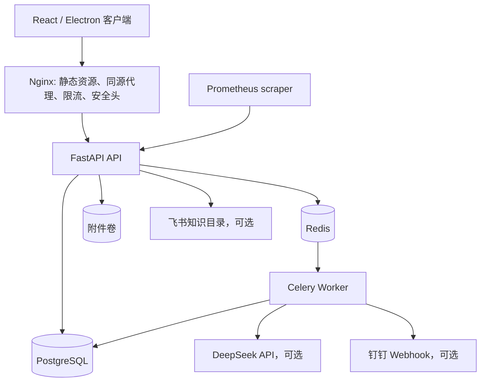
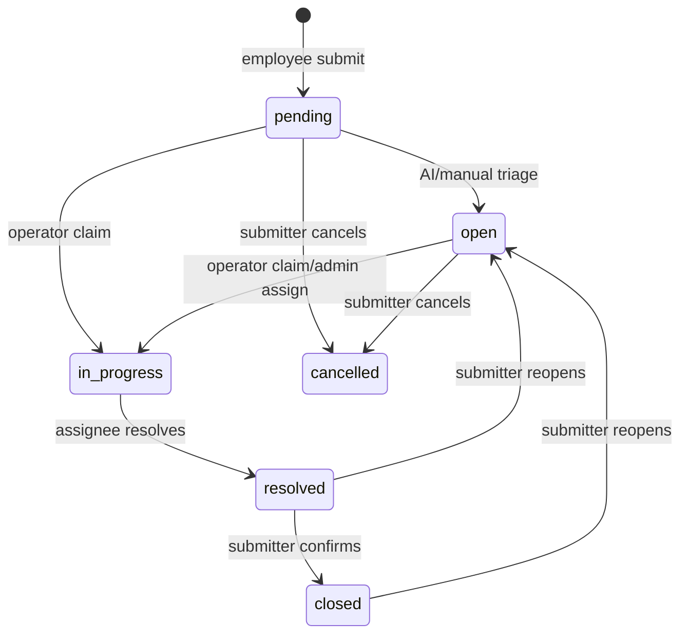
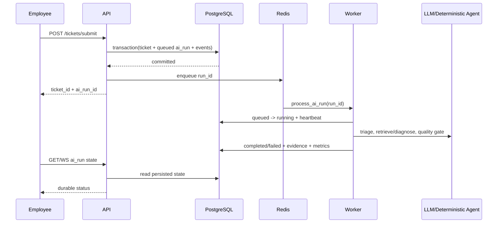

# 架构与关键决策

## 系统边界

IntelliTicket 面向单公司、单实例的内部 IT 服务台。身份、工单、AI 运行、通知结果和审计事件存储在 PostgreSQL；Redis 只承担 Celery broker/result backend，不是业务事实来源；附件保存在独立持久卷中。

## 模块职责

| 层 | 目录 | 职责 |
|---|---|---|
| API | `src/intelliticket_backend/api` | 认证依赖、请求校验、响应模型和路由 |
| Service | `src/intelliticket_backend/services` | 状态机、AI 管线、附件、通知与外部集成 |
| Repository | `src/intelliticket_backend/repositories` | SQL 条件更新、分页查询、审计写入 |
| Model/Schema | `models`、`schemas` | SQLAlchemy 持久模型和 Pydantic 契约 |
| Worker | `services/worker_tasks.py` | AI/通知任务、有限重试、恢复和结果持久化 |
| Frontend | `frontend/src/renderer/src/pages` | 员工、运维、管理员三个工作区 |

## 工单状态机

所有状态写操作都带客户端看到的 `version`。Repository 使用 `WHERE ticket_id = ? AND version = ? AND status IN (...)` 条件更新并将版本加一，因此并发认领不会依赖进程内锁；失败方得到 409 和当前版本。

## AI 异步时序

先提交数据库再入队，保证 broker 故障时工单和失败的 AI 运行仍可查询。Worker 通过原子 `queued -> running` 更新获得执行权；重复投递或任务重放读取已有终态，不重复写 AI 完成事件。陈旧的 running 任务按 heartbeat 恢复为 queued，并增加 retry_count。

## 为什么必须人工确认

AI 输出是建议而不是业务状态机的最终裁决。Quality Gate 校验证据引用并强制 `requires_human_review=true`；运维决定是否采纳、修改或拒绝建议。解决工单必须由当前处理人提交完整的解决摘要、根因、修复动作和验证结果，员工随后确认关闭或重新打开。

## 权限边界

| 行为 | employee | operator | admin |
|---|---:|---:|---:|
| 创建/查看自己的工单 | 是 | 是 | 是 |
| 查看他人工单和运维队列 | 否 | 是 | 是 |
| 认领、公开回复、内部备注 | 否 | 是 | 是 |
| 转派、用户/团队/SLA/目录管理 | 否 | 否 | 是 |
| 确认关闭自己的工单 | 是 | 否 | 是 |

JWT 每次请求都回查数据库用户，停用账号后旧 Token 立即失效。附件和评论沿用工单可见性；内部备注仅 operator/admin 可读。

## SLA 计算

管理员维护按优先级划分的响应和解决时限。创建/分诊时根据 `created_at + policy duration` 写入 `response_due_at` 和 `resolution_due_at`。第一条运维公开回复设置 `first_responded_at`；解决设置 `resolved_at`。逾期查询和 Prometheus gauge 分别比较当前时间与两个 deadline，关闭/取消工单不再计入开放逾期。

## 故障行为

- LLM 超时：AI 运行有限重试，终止后记录 error_code；人工流程保持可用。
- Redis 不可用：`/ready` 返回 503，`/health` 仍返回 200；入队失败持久化为 `AI_QUEUE_UNAVAILABLE`。
- Worker 重启：已提交消息留在 Redis；running 超过阈值可恢复，重复执行不重复完成。
- 通知失败：通知记录独立重试，失败不回滚已提交的工单状态。
- 附件存储失败：数据库事务回滚，并删除已写入的随机存储对象。

## 部署拓扑与限制

Compose 包含 PostgreSQL、Redis、一次性 migration、API、Worker、Frontend/Nginx 和 maintenance profile。当前没有 API/Worker 横向扩容、Redis Sentinel、PostgreSQL HA 或对象存储设计，因此不做生产容量和可用性等级承诺。
